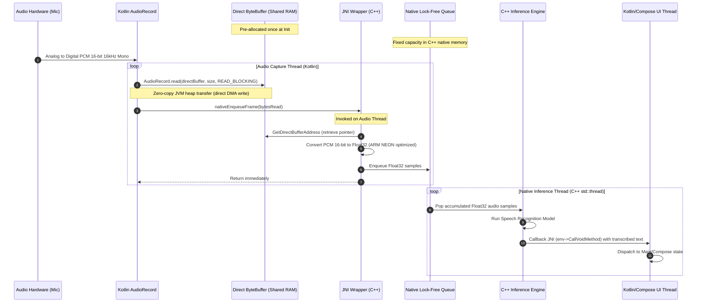

# JNI Architecture Design & Zero-Copy Audio Pipeline Study

## 1. Data Flow Architecture

The primary goal of the audio pipeline is to stream continuous PCM 16-bit mono audio at 16,000 Hz from the Android hardware layer to the native C++ speech recognition engine (Whisper / Sherpa-onnx) on low-end tablets. This must happen in real time with minimal latency (target < 100ms pipeline delay) and zero GC allocations in the hot path.

### Continuous Data Flow Diagram (Mermaid)



### Detailed Data Flow Steps
1. **Hardware Capture**: The microphone driver captures analog audio, performing hardware-level analog-to-digital conversion to produce a raw PCM 16-bit mono stream at 16,000 Hz.
2. **Kotlin AudioRecord**: `AudioRecord` reads the hardware buffer directly into the memory region pointed to by the pre-allocated Direct `ByteBuffer`. This utilizes Direct Memory Access (DMA), avoiding copy operations to the Java virtual machine heap.
3. **JNI Notification**: Once `AudioRecord.read()` completes blocking (typically every 100ms, reading 3,200 bytes / 1,600 samples), Kotlin invokes `nativeEnqueueFrame(bytesRead)` on the same thread.
4. **C++ Sample Conversion & Buffering**:
   - The JNI C++ function retrieves the pointer to the Direct `ByteBuffer` memory address using the cached address pointer (resolved once during initialization).
   - The 16-bit integer PCM values are normalized into 32-bit floating-point numbers in the range `[-1.0f, 1.0f]`. This conversion is accelerated using ARM NEON SIMD intrinsics.
   - The normalized float samples are enqueued into a thread-safe, native, lock-free SPSC (Single Producer Single Consumer) queue.
5. **C++ Inference Processing**: A background C++ thread constantly polls or waits on the lock-free queue. Once it gathers a sufficient number of samples (depending on the speech engine's window size, e.g. 30 seconds for Whisper or continuous streaming chunks of 200ms-400ms for Sherpa-onnx), it runs inference on the offline speech recognition model.
6. **Result Callback**: The inference thread invokes a cached Java/Kotlin listener method via JNI (`CallVoidMethod`) to post the partial or final text results. The listener forwards this to the Android UI thread via Kotlin Coroutines (e.g. `Dispatchers.Main`) or Compose state variables.

---

## 2. Zero-Copy Buffer Architecture

Traditional JNI data transfers rely on passing Java arrays (e.g., `jbyteArray`) which require `GetByteArrayRegion` or `GetPrimitiveArrayCritical`. These approaches have severe drawbacks in real-time systems:
1. **Garbage Collection (GC) Churn**: Allocating new byte arrays in a tight loop (~10 times per second) triggers frequent GC cycles, causing UI micro-stutters and audio dropouts (glitches) on low-end devices.
2. **JNI Copy Overhead**: Passing Java heap arrays to C++ often forces the JVM to make temporary copies of the entire buffer to avoid heap fragmentation during garbage collection.

### Direct ByteBuffer Design
To completely bypass these overheads, we use **Direct ByteBuffers** (`ByteBuffer.allocateDirect(capacity)`).

1. **One-Time Allocation**:
   - The direct buffer is allocated *once* during initialization in Kotlin.
   - The capacity is sized exactly to fit one audio frame (e.g., 100ms frame = `1600 samples * 2 bytes/sample = 3200 bytes`).
   - The byte order must be configured to match the hardware's native byte order (typically Little Endian on Android ARM platforms):
     ```kotlin
     val directBuffer = ByteBuffer.allocateDirect(3200).order(ByteOrder.nativeOrder())
     ```
2. **Cached Native Address**:
   - During setup, the direct buffer instance is registered with the C++ layer.
   - C++ retrieves the raw memory address using the JNI function:
     ```cpp
     void* rawPtr = env->GetDirectBufferAddress(jBuffer);
     auto* audioBuffer = static_cast<int16_t*>(rawPtr);
     ```
   - This raw pointer is stored in a native C++ object. Because the buffer is pinned and allocated outside the JVM garbage-collected heap, its physical address is guaranteed to remain constant throughout the lifetime of the application.
3. **Zero JNI Hot-Path Overhead**:
   - In the recording loop, Kotlin writes to the direct buffer, then calls:
     ```kotlin
     nativeEnqueueFrame(bytesRead)
     ```
   - This JNI function takes only a primitive integer, completely avoiding object parameters (no `jobject` resolution in the critical loop).
   - In C++, the audio thread reads directly from the pre-cached `audioBuffer` pointer.

### Memory Synchronization & Thread Safety
- **No Race Conditions**: The Kotlin audio thread and the native JNI conversion code run sequentially on the *same physical thread* (the Kotlin Audio Capture Thread). 
- **Sequential Write-Then-Read**: Kotlin writes to the buffer -> Kotlin calls JNI -> JNI reads from the buffer. Because this is synchronous, there is no chance of Kotlin overwriting the buffer while JNI is reading it.
- Once JNI completes copying/converting the data into the native queue, the JNI call returns, and Kotlin is safe to write the next frame.
- **Cache Coherency**: Direct ByteBuffers are allocated using non-cacheable or write-combined memory when possible, or JVM JNI implementations handle cache coherency. Since both layers access the same physical address, memory changes made by the hardware DMA / AudioRecord are immediately visible to C++.

---

## 3. High-Performance Threading Model

To guarantee the UI thread is never blocked, the architecture separates audio acquisition, buffering, conversion, inference, and UI rendering into distinct threads.

### Three-Thread Design

```
+------------------------------------+
|            UI Thread               | <-- [Updates Compose UI, Page highlights]
+------------------------------------+
                   ^
                   | (env->CallVoidMethod via Main Dispatcher)
                   |
+------------------------------------+
|     Kotlin Audio Capture Thread    | <-- [Blocking AudioRecord.read() in a loop]
+------------------------------------+
                   |
                   | (nativeEnqueueFrame)
                   v
+------------------------------------+
|  Native C++ JNI Conversion (SIMD)  | <-- [Converts PCM16 -> Float32 & pushes to Queue]
+------------------------------------+
                   |
                   | (std::atomic SPSC Queue)
                   v
+------------------------------------+
|     Native C++ Inference Thread     | <-- [Polls Queue, runs Whisper/Sherpa-onnx]
+------------------------------------+
```

### Thread Descriptions & Priorities

1. **UI Thread (Java/Kotlin Main)**:
   - Responsible for rendering the Mushaf layout and handling user input.
   - Free from any audio or speech recognition overhead.
2. **Audio Capture Thread (Kotlin)**:
   - Spawns a dedicated thread with a priority set to `android.os.Process.THREAD_PRIORITY_AUDIO`.
   - Executes the blocking `AudioRecord.read()` loop.
   - Invokes `nativeEnqueueFrame(bytesRead)` to transfer data to native memory.
3. **C++ Inference Thread (Native)**:
   - Spawns a native thread (`std::thread` or `pthread`) from C++ during initialization.
   - Thread priority is set to real-time speech processing priority using `sched_setscheduler` or set thread nice value to `-16` (audio thread priority) to prevent the OS from throttling inference under heavy CPU load.
   - Waits on a conditional variable or polls a lock-free queue for samples.
   - Runs model inference and calls back to Java when new text is generated.

### Lock-Free Native SPSC Ring Buffer
To avoid mutex contention and thread locking overhead on low-end CPUs, the data transfer between the Audio Capture Thread (Producer) and the Inference Thread (Consumer) uses a Single Producer Single Consumer (SPSC) ring buffer implemented with atomic memory barriers.

```cpp
#include <atomic>
#include <vector>

template <typename T, size_t Capacity>
class SPSCQueue {
public:
    SPSCQueue() : head_(0), tail_(0) {
        ring_buffer_.resize(Capacity);
    }

    bool push(const T& val) {
        size_t const current_head = head_.load(std::memory_order_relaxed);
        size_t const current_tail = tail_.load(std::memory_order_acquire);
        if ((current_head + 1) % Capacity == current_tail) {
            return false; // Queue full
        }
        ring_buffer_[current_head] = val;
        head_.store((current_head + 1) % Capacity, std::memory_order_release);
        return true;
    }

    bool pop(T& val) {
        size_t const current_head = head_.load(std::memory_order_acquire);
        size_t const current_tail = tail_.load(std::memory_order_relaxed);
        if (current_tail == current_head) {
            return false; // Queue empty
        }
        val = ring_buffer_[current_tail];
        tail_.store((current_tail + 1) % Capacity, std::memory_order_release);
        return true;
    }

private:
    std::vector<T> ring_buffer_;
    std::atomic<size_t> head_;
    std::atomic<size_t> tail_;
};
```

### ARM NEON SIMD Format Conversion
Speech engines typically expect `float32` values normalized to `[-1.0f, 1.0f]`. Converting `int16` samples in Java is slow. In native C++, we use ARM NEON SIMD to convert 8 samples in parallel:

```cpp
#include <arm_neon.h>

void convertInt16ToFloatNeon(const int16_t* src, float* dest, int count) {
    int i = 0;
    // Factor: 1.0f / 32768.0f
    float32x4_t factor = vdupq_n_f32(1.0f / 32768.0f);

    // Process 8 elements at a time
    for (; i <= count - 8; i += 8) {
        // Load 8 signed 16-bit integers
        int16x8_t int16_vec = vld1q_s16(src + i);

        // Split into two 4-element signed 32-bit integer vectors
        int32x4_t low_int32 = vmovl_s16(vget_low_s16(int16_vec));
        int32x4_t high_int32 = vmovl_s16(vget_high_s16(int16_vec));

        // Convert to floats
        float32x4_t low_float = vcvtq_f32_s32(low_int32);
        float32x4_t high_float = vcvtq_f32_s32(high_int32);

        // Multiply by normalization factor
        float32x4_t low_norm = vmulq_f32(low_float, factor);
        float32x4_t high_norm = vmulq_f32(high_float, factor);

        // Store result
        vst1q_f32(dest + i, low_norm);
        vst1q_f32(dest + i + 4, high_norm);
    }

    // Process remaining elements (scalar fallback)
    for (; i < count; ++i) {
        dest[i] = static_cast<float>(src[i]) / 32768.0f;
    }
}
```

---

## 4. JNI Interface Specification

To implement a clean bridge, we formulate the explicit Kotlin class declarations, the native JNI bindings, and the corresponding C++ header and registration structures.

### A. Kotlin Interface (`SpeechRecognizerBridge.kt`)

```kotlin
package com.mushafqiyam.speech

import java.nio.ByteBuffer

class SpeechRecognizerBridge(private val listener: SpeechRecognitionListener) {

    interface SpeechRecognitionListener {
        fun onPartialResult(text: String)
        fun onFinalResult(text: String)
        fun onError(errorCode: Int, errorMessage: String)
    }

    companion object {
        init {
            System.loadLibrary("mushafqiyam")
        }
    }

    // Native lifecycle methods
    external fun nativeInitialize(modelPath: String, vocabPath: String): Boolean
    external fun nativeRegisterDirectBuffer(buffer: ByteBuffer): Boolean
    external fun nativeStartListening(): Boolean
    external fun nativeEnqueueFrame(bytesRead: Int): Int
    external fun nativeStopListening()
    external fun nativeRelease()
}
```

### B. Native C++ Header (`speech_recognizer_jni.h`)

```cpp
#pragma once

#include <jni.h>
#include <string>
#include <vector>
#include <atomic>
#include <thread>
#include <mutex>
#include <condition_variable>
#include "spsc_queue.h" // SPSCQueue defined above

namespace mushafqiyam {

class SpeechRecognizerBridge {
public:
    SpeechRecognizerBridge();
    ~SpeechRecognizerBridge();

    bool initialize(JNIEnv* env, jobject thiz, const std::string& model_path, const std::string& vocab_path);
    bool registerDirectBuffer(JNIEnv* env, jobject direct_buffer);
    bool startListening(JNIEnv* env);
    int enqueueFrame(int bytes_read);
    void stopListening();
    void release(JNIEnv* env);

    // Getters for internal status
    bool isListening() const { return is_listening_.load(); }

private:
    void inferenceLoop();
    void performInference(const std::vector<float>& samples);
    void sendCallback(const std::string& text, bool is_final);

    // JNI Cached References
    JavaVM* java_vm_ = nullptr;
    jobject listener_global_ref_ = nullptr;
    jmethodID on_partial_result_mid_ = nullptr;
    jmethodID on_final_result_mid_ = nullptr;
    jmethodID on_error_mid_ = nullptr;

    // Buffer Reference
    int16_t* direct_buffer_ptr_ = nullptr;
    jlong direct_buffer_capacity_ = 0;

    // Threading and State
    std::atomic<bool> is_initialized_{false};
    std::atomic<bool> is_listening_{false};
    std::thread inference_thread_;
    std::mutex thread_mutex_;
    std::condition_variable cv_;

    // Lock-free queue for float samples
    // capacity: 16000 samples/sec * 10 seconds = 160000 floats
    SPSCQueue<float, 160000> sample_queue_;
};

} // namespace mushafqiyam
```

### C. Native C++ Source & Manual JNI Registration (`speech_recognizer_jni.cpp`)

Instead of resolving functions dynamically by class name (which introduces dynamic symbol overhead and slows execution), we register JNI methods manually using `RegisterNatives` inside `JNI_OnLoad`.

```cpp
#include "speech_recognizer_jni.h"
#include <android/log.h>

#define LOG_TAG "MushafSpeechJNI"
#define LOGI(...) __android_log_print(ANDROID_LOG_INFO, LOG_TAG, __VA_ARGS__)
#define LOGE(...) __android_log_print(ANDROID_LOG_ERROR, LOG_TAG, __VA_ARGS__)

namespace {
    mushafqiyam::SpeechRecognizerBridge* g_bridge = nullptr;
}

extern "C" {

static jboolean nativeInitialize(JNIEnv* env, jobject thiz, jstring model_path, jstring vocab_path) {
    if (g_bridge == nullptr) {
        g_bridge = new mushafqiyam::SpeechRecognizerBridge();
    }
    
    const char* m_path = env->GetStringUTFChars(model_path, nullptr);
    const char* v_path = env->GetStringUTFChars(vocab_path, nullptr);
    
    bool result = g_bridge->initialize(env, thiz, m_path, v_path);
    
    env->ReleaseStringUTFChars(model_path, m_path);
    env->ReleaseStringUTFChars(vocab_path, v_path);
    
    return result ? JNI_TRUE : JNI_FALSE;
}

static jboolean nativeRegisterDirectBuffer(JNIEnv* env, jobject thiz, jobject direct_buffer) {
    if (g_bridge == nullptr) return JNI_FALSE;
    return g_bridge->registerDirectBuffer(env, direct_buffer) ? JNI_TRUE : JNI_FALSE;
}

static jboolean nativeStartListening(JNIEnv* env, jobject thiz) {
    if (g_bridge == nullptr) return JNI_FALSE;
    return g_bridge->startListening(env) ? JNI_TRUE : JNI_FALSE;
}

static jint nativeEnqueueFrame(JNIEnv* env, jobject thiz, jint bytes_read) {
    if (g_bridge == nullptr) return -1;
    return g_bridge->enqueueFrame(bytes_read);
}

static void nativeStopListening(JNIEnv* env, jobject thiz) {
    if (g_bridge != nullptr) {
        g_bridge->stopListening();
    }
}

static void nativeRelease(JNIEnv* env, jobject thiz) {
    if (g_bridge != nullptr) {
        g_bridge->release(env);
        delete g_bridge;
        g_bridge = nullptr;
    }
}

// Map of Kotlin methods to C++ JNI functions
static JNINativeMethod g_methods[] = {
    {"nativeInitialize", "(Ljava/lang/String;Ljava/lang/String;)Z", (void*)&nativeInitialize},
    {"nativeRegisterDirectBuffer", "(Ljava/nio/ByteBuffer;)Z", (void*)&nativeRegisterDirectBuffer},
    {"nativeStartListening", "()Z", (void*)&nativeStartListening},
    {"nativeEnqueueFrame", "(I)I", (void*)&nativeEnqueueFrame},
    {"nativeStopListening", "()V", (void*)&nativeStopListening},
    {"nativeRelease", "()V", (void*)&nativeRelease}
};

JNIEXPORT jint JNI_OnLoad(JavaVM* vm, void* reserved) {
    JNIEnv* env = nullptr;
    if (vm->GetEnv(reinterpret_cast<void**>(&env), JNI_VERSION_1_6) != JNI_OK) {
        return JNI_ERR;
    }

    jclass clazz = env->FindClass("com/mushafqiyam/speech/SpeechRecognizerBridge");
    if (clazz == nullptr) {
        LOGE("Failed to find SpeechRecognizerBridge class.");
        return JNI_ERR;
    }

    if (env->RegisterNatives(clazz, g_methods, sizeof(g_methods) / sizeof(g_methods[0])) < 0) {
        LOGE("Failed to register native methods for SpeechRecognizerBridge.");
        return JNI_ERR;
    }

    LOGI("JNI SpeechRecognizerBridge methods registered successfully.");
    return JNI_VERSION_1_6;
}

} // extern "C"

// Implementation of Bridge C++ methods (Skeletons)
namespace mushafqiyam {

SpeechRecognizerBridge::SpeechRecognizerBridge() = default;

SpeechRecognizerBridge::~SpeechRecognizerBridge() = default;

bool SpeechRecognizerBridge::initialize(JNIEnv* env, jobject thiz, const std::string& model_path, const std::string& vocab_path) {
    env->GetJavaVM(&java_vm_);

    // Obtain the class of the current object and retrieve listener field
    jclass bridgeClass = env->GetObjectClass(thiz);
    jfieldID listenerField = env->GetFieldID(bridgeClass, "listener", "Lcom/mushafqiyam/speech/SpeechRecognizerBridge$SpeechRecognitionListener;");
    if (listenerField == nullptr) return false;

    jobject listenerObj = env->GetObjectField(thiz, listenerField);
    if (listenerObj == nullptr) return false;

    // Cache listener global reference to prevent GC from reclaiming it
    listener_global_ref_ = env->NewGlobalRef(listenerObj);

    // Cache listener method IDs
    jclass listenerClass = env->GetObjectClass(listener_global_ref_);
    on_partial_result_mid_ = env->GetMethodID(listenerClass, "onPartialResult", "(Ljava/lang/String;)V");
    on_final_result_mid_ = env->GetMethodID(listenerClass, "onFinalResult", "(Ljava/lang/String;)V");
    on_error_mid_ = env->GetMethodID(listenerClass, "onError", "(ILjava/lang/String;)V");

    if (on_partial_result_mid_ == nullptr || on_final_result_mid_ == nullptr || on_error_mid_ == nullptr) {
        LOGE("Failed to locate listener callback method IDs.");
        return false;
    }

    // [Model loading logic goes here...]

    is_initialized_.store(true);
    return true;
}

bool SpeechRecognizerBridge::registerDirectBuffer(JNIEnv* env, jobject direct_buffer) {
    if (direct_buffer == nullptr) {
        direct_buffer_ptr_ = nullptr;
        direct_buffer_capacity_ = 0;
        return false;
    }

    direct_buffer_ptr_ = static_cast<int16_t*>(env->GetDirectBufferAddress(direct_buffer));
    direct_buffer_capacity_ = env->GetDirectBufferCapacity(direct_buffer);

    if (direct_buffer_ptr_ == nullptr) {
        LOGE("Passed ByteBuffer is not a Direct ByteBuffer or is not supported by JNI.");
        return false;
    }

    LOGI("Direct Buffer Registered. Ptr: %p, Capacity in Bytes: %lld", direct_buffer_ptr_, direct_buffer_capacity_);
    return true;
}

bool SpeechRecognizerBridge::startListening(JNIEnv* env) {
    if (!is_initialized_.load() || direct_buffer_ptr_ == nullptr) return false;
    if (is_listening_.load()) return true;

    is_listening_.store(true);
    inference_thread_ = std::thread(&SpeechRecognizerBridge::inferenceLoop, this);
    
    // Set thread nice/priority inside inferenceLoop to prevent UI stutter
    return true;
}

int SpeechRecognizerBridge::enqueueFrame(int bytes_read) {
    if (!is_listening_.load() || direct_buffer_ptr_ == nullptr) return 0;

    int sample_count = bytes_read / sizeof(int16_t);
    
    // Temporary stack allocation for floats conversion (avoid heap allocation churn in audio loop)
    // 3200 bytes / 2 = 1600 samples
    float float_buffer[1600]; 
    int count_to_process = std::min(sample_count, 1600);

    // Call SIMD conversion
    void convertInt16ToFloatNeon(const int16_t* src, float* dest, int count);
    convertInt16ToFloatNeon(direct_buffer_ptr_, float_buffer, count_to_process);

    // Enqueue samples into lock-free SPSC Queue
    int enqueued = 0;
    for (int i = 0; i < count_to_process; ++i) {
        if (sample_queue_.push(float_buffer[i])) {
            enqueued++;
        } else {
            LOGE("SPSC Queue overflow! Native inference thread cannot consume fast enough.");
            break;
        }
    }

    // Wake up inference thread if it's waiting
    cv_.notify_one();

    return enqueued;
}

void SpeechRecognizerBridge::stopListening() {
    if (!is_listening_.load()) return;
    
    is_listening_.store(false);
    cv_.notify_one();

    if (inference_thread_.joinable()) {
        inference_thread_.join();
    }
}

void SpeechRecognizerBridge::release(JNIEnv* env) {
    stopListening();
    
    if (listener_global_ref_ != nullptr) {
        env->DeleteGlobalRef(listener_global_ref_);
        listener_global_ref_ = nullptr;
    }
    
    is_initialized_.store(false);
    direct_buffer_ptr_ = nullptr;
}

void SpeechRecognizerBridge::inferenceLoop() {
    // Attach thread to Java VM
    JNIEnv* env = nullptr;
    JavaVMAttachArgs args;
    args.version = JNI_VERSION_1_6;
    args.name = "InferenceThread";
    args.group = nullptr;

    if (java_vm_->AttachCurrentThread(&env, &args) != JNI_OK) {
        LOGE("Failed to attach native inference thread to JVM.");
        return;
    }

    LOGI("Native inference thread started and attached to JVM.");

    // Accumulator for model frame
    std::vector<float> inference_buffer;
    
    // Standard streaming frame size (e.g. 8000 samples = 500ms window)
    const size_t target_chunk_size = 8000; 
    inference_buffer.reserve(target_chunk_size);

    while (is_listening_.load()) {
        float sample;
        bool has_data = false;

        // Collect all available samples in queue
        while (sample_queue_.pop(sample)) {
            inference_buffer.push_back(sample);
            has_data = true;
        }

        if (inference_buffer.size() >= target_chunk_size) {
            // Process chunk
            performInference(inference_buffer);
            inference_buffer.clear();
        }

        if (!has_data) {
            // Wait for new data if queue was empty
            std::unique_lock<std::mutex> lock(thread_mutex_);
            cv_.wait_for(lock, std::chrono::milliseconds(50));
        }
    }

    // Process remainder samples on shutdown
    if (!inference_buffer.empty()) {
        performInference(inference_buffer);
    }

    java_vm_->DetachCurrentThread();
    LOGI("Native inference thread detached and terminated.");
}

void SpeechRecognizerBridge::performInference(const std::vector<float>& samples) {
    // [Call the underlying Speech Engine (Whisper / Sherpa-onnx) here]
    // Mock callback for demonstration:
    // std::string result = runModelInference(samples);
    // sendCallback(result, false);
}

void SpeechRecognizerBridge::sendCallback(const std::string& text, bool is_final) {
    JNIEnv* env = nullptr;
    if (java_vm_->GetEnv(reinterpret_cast<void**>(&env), JNI_VERSION_1_6) == JNI_OK) {
        jstring jText = env->NewStringUTF(text.c_str());
        
        jmethodID method = is_final ? on_final_result_mid_ : on_partial_result_mid_;
        env->CallVoidMethod(listener_global_ref_, method, jText);
        
        env->DeleteLocalRef(jText); // Avoid local reference leaks
    }
}

} // namespace mushafqiyam
